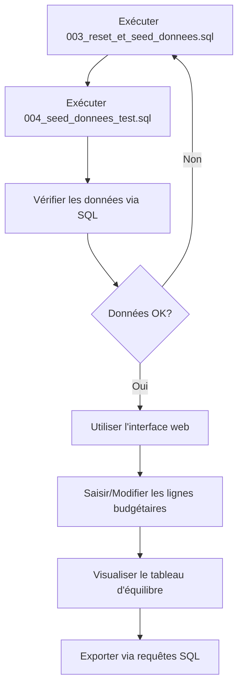

# Guide d'utilisation des scripts de seed

Ce guide explique comment réinitialiser et peupler votre base de données à partir du fichier Excel `Tableaux_de_Compte_Administratif.xlsx`.

## 📁 Fichiers disponibles

### 1. `003_reset_et_seed_donnees.sql` (96 KB)
**Script principal de réinitialisation et seed**

✅ Contenu :
- Nettoyage complet des données existantes
- Insertion de 12 colonnes dynamiques
- Insertion de 436 rubriques budgétaires (166 recettes + 270 dépenses)
- Instructions pour créer un compte administratif

📊 Rubriques extraites du fichier Excel :
- **RECETTES** : 166 rubriques avec codes comptables (70, 71, 72, 74, 75, 76, 77)
- **DÉPENSES** : 270 rubriques avec codes comptables (60, 61, 62, 63, 64, 65, 66, 67)

### 2. `004_seed_donnees_test.sql` (15 KB)
**Script de génération de données de test complètes**

✅ Contenu :
- Création d'une région de test (RG-TEST)
- Création d'un district de test (DT-TEST)
- Création d'une commune de test (COM-TEST)
- Création d'un compte administratif pour 2024
- Insertion de 15 lignes budgétaires avec des valeurs réalistes

## 🚀 Instructions d'exécution

### Étape 1 : Réinitialiser et peupler la base

```sql
-- Dans Supabase SQL Editor, exécutez dans cet ordre :

-- 1. Nettoyage et insertion des rubriques
\i 003_reset_et_seed_donnees.sql

-- 2. Création de données de test
\i 004_seed_donnees_test.sql
```

⚠️ **ATTENTION** : Le script `003_reset_et_seed_donnees.sql` supprime TOUTES les données existantes dans :
- `lignes_budgetaires`
- `comptes_administratifs`
- `colonnes_dynamiques`
- `rubriques_budgetaires`
- `categories_rubriques`

### Étape 2 : Vérifier les résultats

```sql
-- Vérifier les colonnes dynamiques
SELECT applicable_a, COUNT(*) as nb_colonnes
FROM colonnes_dynamiques
WHERE est_active = true
GROUP BY applicable_a;

-- Résultat attendu :
-- applicable_a | nb_colonnes
-- -------------|------------
-- depense      | 5
-- recette      | 4
-- tous         | 4

-- Vérifier les rubriques
SELECT type, section, COUNT(*) as nb_rubriques
FROM rubriques_budgetaires
WHERE est_active = true
GROUP BY type, section
ORDER BY type, section;

-- Résultat attendu : ~436 rubriques au total

-- Vérifier le compte administratif de test
SELECT ca.id, ca.annee, c.nom, ca.statut
FROM comptes_administratifs ca
JOIN communes c ON ca.commune_id = c.id
WHERE ca.annee = 2024;
```

## 📊 Structure des colonnes dynamiques

### Colonnes communes (tous)
- `budget_primitif` : Budget voté initial
- `budget_additionnel` : Ajustements budgétaires
- `modifications` : Virements et transferts
- `previsions_definitives` : Budget final (calculé)

### Colonnes RECETTES
- `or_admis` : Ordres de recettes admis
- `recouvrement` : Montant recouvré
- `reste_recouvrer` : Reste à recouvrer (calculé)
- `taux_execution_recette` : Taux d'exécution % (calculé)

### Colonnes DÉPENSES
- `engagement` : Montant engagé
- `mandat_admis` : Mandats de paiement admis
- `paiement` : Montant payé
- `reste_payer` : Reste à payer (calculé)
- `taux_execution_depense` : Taux d'exécution % (calculé)

## 🖥️ Utilisation via l'interface web

### 1. Visualiser le tableau d'équilibre
```
URL : /admin/comptes-administratifs/equilibre

Sélectionner :
- Année : 2024
- Type : Commune
- Collectivité : Commune Test
```

### 2. Saisir/Modifier les lignes budgétaires
```
URL : /admin/comptes-administratifs/lignes-budgetaires

Sélectionner :
- Année : 2024
- Type : Commune
- Collectivité : Commune Test

→ Interface Excel-like avec onglets Recettes/Dépenses
```

### 3. Gérer les comptes administratifs
```
URL : /admin/comptes-administratifs/comptes

Actions disponibles :
- Créer un nouveau compte
- Modifier un compte existant
- Changer le statut (brouillon/validé/publié/archivé)
```

## 📥 Extraire les données au format Excel

### Requête pour les RECETTES (comme dans Excel)

```sql
SELECT
    rb.code as "COMPTE",
    rb.intitule as "INTITULES",
    (lb.valeurs->>'budget_primitif')::numeric as "BUDGET PRIMITIF",
    (lb.valeurs->>'budget_additionnel')::numeric as "BUDGET ADDITIONNEL",
    (lb.valeurs->>'modifications')::numeric as "MODIFICATIONS +/-",
    (lb.valeurs->>'previsions_definitives')::numeric as "PREVISIONS DEFINITIVES (1)",
    (lb.valeurs->>'or_admis')::numeric as "OR ADMIS (2)",
    (lb.valeurs->>'recouvrement')::numeric as "RECOUVREMENT",
    (lb.valeurs->>'reste_recouvrer')::numeric as "RESTE A RECOUVRER",
    CASE
        WHEN (lb.valeurs->>'previsions_definitives')::numeric > 0
        THEN ROUND(((lb.valeurs->>'or_admis')::numeric / (lb.valeurs->>'previsions_definitives')::numeric) * 100, 2)
        ELSE 0
    END as "TAUX D'EXECUTION (%)"
FROM lignes_budgetaires lb
JOIN rubriques_budgetaires rb ON lb.rubrique_id = rb.id
JOIN comptes_administratifs ca ON lb.compte_administratif_id = ca.id
JOIN communes c ON ca.commune_id = c.id
WHERE ca.annee = 2024
  AND c.code = 'COM-TEST'
  AND rb.type = 'recette'
  AND rb.section = 'fonctionnement'
ORDER BY rb.ordre;
```

### Requête pour les DÉPENSES (comme dans Excel)

```sql
SELECT
    rb.code as "COMPTE",
    rb.intitule as "INTITULES",
    (lb.valeurs->>'budget_primitif')::numeric as "BUDGET PRIMITIF",
    (lb.valeurs->>'budget_additionnel')::numeric as "BUDGET ADDITIONNEL",
    (lb.valeurs->>'modifications')::numeric as "MODIFICATIONS +/-",
    (lb.valeurs->>'previsions_definitives')::numeric as "PREVISIONS DEFINITIVES (1)",
    (lb.valeurs->>'engagement')::numeric as "ENGAGEMENT",
    (lb.valeurs->>'mandat_admis')::numeric as "MANDAT ADMIS (2)",
    (lb.valeurs->>'paiement')::numeric as "PAIEMENT",
    (lb.valeurs->>'reste_payer')::numeric as "RESTE A PAYER",
    CASE
        WHEN (lb.valeurs->>'previsions_definitives')::numeric > 0
        THEN ROUND(((lb.valeurs->>'mandat_admis')::numeric / (lb.valeurs->>'previsions_definitives')::numeric) * 100, 2)
        ELSE 0
    END as "TAUX D'EXECUTION (%)"
FROM lignes_budgetaires lb
JOIN rubriques_budgetaires rb ON lb.rubrique_id = rb.id
JOIN comptes_administratifs ca ON lb.compte_administratif_id = ca.id
JOIN communes c ON ca.commune_id = c.id
WHERE ca.annee = 2024
  AND c.code = 'COM-TEST'
  AND rb.type = 'depense'
  AND rb.section = 'fonctionnement'
ORDER BY rb.ordre;
```

### Requête pour le TABLEAU D'ÉQUILIBRE (comme dans Excel)

```sql
-- Utiliser la vue SQL pré-définie
SELECT * FROM v_equilibre_compte_administratif
WHERE annee = 2024;

-- OU construire manuellement :

-- DÉPENSES de fonctionnement
SELECT
    rb.code as compte,
    rb.intitule,
    SUM((lb.valeurs->>'mandat_admis')::numeric) as mandat_admis,
    SUM((lb.valeurs->>'paiement')::numeric) as paiement,
    SUM((lb.valeurs->>'reste_payer')::numeric) as reste_payer
FROM lignes_budgetaires lb
JOIN rubriques_budgetaires rb ON lb.rubrique_id = rb.id
JOIN comptes_administratifs ca ON lb.compte_administratif_id = ca.id
WHERE ca.annee = 2024
  AND rb.type = 'depense'
  AND rb.section = 'fonctionnement'
  AND rb.niveau = 1  -- Niveau agrégé uniquement
GROUP BY rb.code, rb.intitule, rb.ordre
ORDER BY rb.ordre;

-- RECETTES de fonctionnement
SELECT
    rb.code as compte,
    rb.intitule,
    SUM((lb.valeurs->>'or_admis')::numeric) as or_admis,
    SUM((lb.valeurs->>'recouvrement')::numeric) as recouvrement,
    SUM((lb.valeurs->>'reste_recouvrer')::numeric) as reste_recouvrer
FROM lignes_budgetaires lb
JOIN rubriques_budgetaires rb ON lb.rubrique_id = rb.id
JOIN comptes_administratifs ca ON lb.compte_administratif_id = ca.id
WHERE ca.annee = 2024
  AND rb.type = 'recette'
  AND rb.section = 'fonctionnement'
  AND rb.niveau = 1  -- Niveau agrégé uniquement
GROUP BY rb.code, rb.intitule, rb.ordre
ORDER BY rb.ordre;
```

## 📈 Calculs automatiques

Les valeurs suivantes sont calculées automatiquement par les triggers SQL :

### Pour les RECETTES :
- `previsions_definitives` = `budget_primitif` + `budget_additionnel` + `modifications`
- `reste_recouvrer` = `or_admis` - `recouvrement`
- `taux_execution` = (`or_admis` / `previsions_definitives`) × 100

### Pour les DÉPENSES :
- `previsions_definitives` = `budget_primitif` + `budget_additionnel` + `modifications`
- `reste_payer` = `mandat_admis` - `paiement`
- `taux_execution` = (`mandat_admis` / `previsions_definitives`) × 100

⚠️ Ces calculs sont effectués automatiquement lors de l'insertion/mise à jour via le trigger `calculer_valeurs_derivees()`.

## 🔄 Workflow complet



## 🆘 Dépannage

### Erreur : "violates foreign key constraint"
**Solution** : Assurez-vous d'avoir exécuté le script `schema.sql` principal avant les scripts de seed.

### Erreur : "duplicate key value"
**Solution** : Le script `003_reset_et_seed_donnees.sql` nettoie déjà les données. Si l'erreur persiste, exécutez manuellement :
```sql
DELETE FROM lignes_budgetaires;
DELETE FROM comptes_administratifs;
DELETE FROM rubriques_budgetaires;
DELETE FROM colonnes_dynamiques;
```

### Valeurs calculées incorrectes
**Solution** : Vérifiez que le trigger `calculer_valeurs_derivees()` est bien actif :
```sql
SELECT * FROM pg_trigger WHERE tgname = 'trg_calculer_valeurs_derivees';
```

### Vue v_equilibre_compte_administratif introuvable
**Solution** : Recréez la vue en exécutant la partie correspondante du `schema.sql`.

## 📝 Personnalisation

### Créer vos propres données de test

Modifiez le script `004_seed_donnees_test.sql` :

```sql
-- Changez les valeurs de la commune
INSERT INTO communes (code, nom, district_id, population)
VALUES ('VOTRE-CODE', 'Votre Commune', '<district_id>', 50000);

-- Ajustez les montants budgétaires
INSERT INTO lignes_budgetaires (compte_administratif_id, rubrique_id, valeurs)
VALUES (v_compte_id, v_rubrique_id, jsonb_build_object(
    'budget_primitif', 1000000,  -- Modifiez ici
    'or_admis', 950000           -- Et ici
));
```

### Ajouter des rubriques personnalisées

```sql
INSERT INTO rubriques_budgetaires (code, intitule, type, section, niveau, ordre, est_active)
VALUES ('7999', 'Votre nouvelle rubrique', 'recette', 'fonctionnement', 3, 9999, true);
```

## ✅ Checklist finale

- [ ] Script `003_reset_et_seed_donnees.sql` exécuté avec succès
- [ ] Script `004_seed_donnees_test.sql` exécuté avec succès
- [ ] 436 rubriques budgétaires insérées
- [ ] 12 colonnes dynamiques créées
- [ ] Compte administratif 2024 créé
- [ ] Lignes budgétaires de test insérées
- [ ] Interface web accessible et fonctionnelle
- [ ] Tableau d'équilibre s'affiche correctement
- [ ] Requêtes SQL de vérification réussies

---

**Date de création** : 2025-11-17
**Basé sur** : `Tableaux_de_Compte_Administratif.xlsx`
**Version** : 1.0
